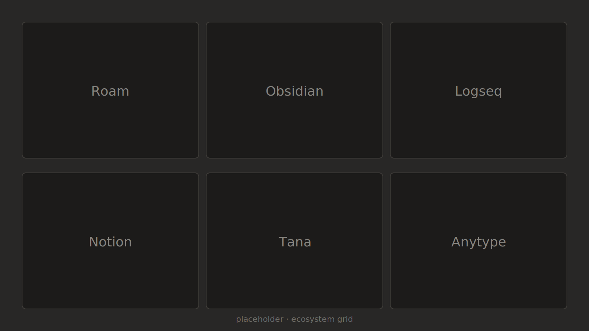
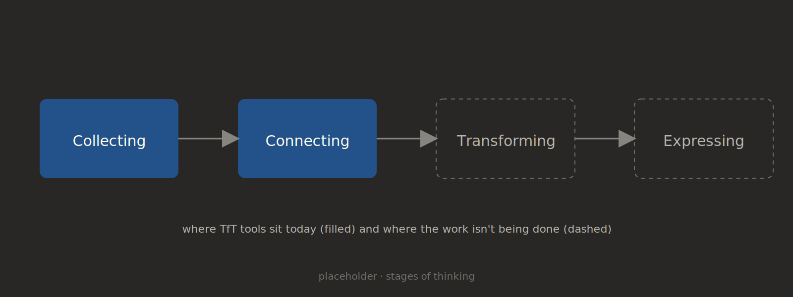
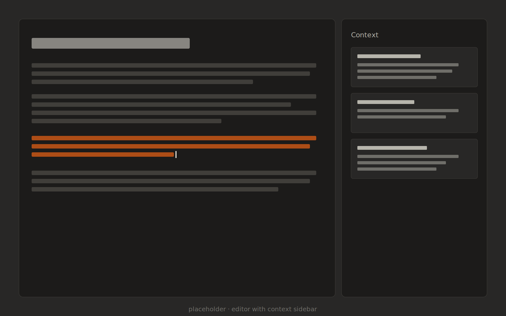

The idea of software that helps you think has been around since the 1940s. The promise was that software would change the act of thinking itself, not just store what you have already thought.

If you use any of today's most popular tools-for-thought apps, you might wonder where that promise went.

*The current shape of the TfT software ecosystem.*

Most of the leaders in the category are excellent file managers with extras. Roam introduced bidirectional links. Obsidian made the file format your own. Logseq is outliner-first. Notion turned databases into blocks. None of them are doing anything that a sufficiently determined person couldn't do with a folder of markdown files and ripgrep. The interfaces are nicer, the commitment to the format is higher, and the fundamental operation is still the same: write a note, link a note, find it later.

Filing isn't the same activity as thinking. It is a necessary precondition for thinking, because you can't reason about something you can't find again. But it isn't sufficient, and most of the marketing copy for these tools implies that it is. People who adopt a TfT tool with the goal of thinking better tend to adopt the filing habits and then plateau. They end up with a lot of notes, but not with more or better ideas.

Most people already have an archive like this, whether they chose one or not: meeting notes, book highlights, half-finished drafts, design docs from old projects. The archive grows. Whether any of it changes a decision you make six months later is a separate question, and the honest answer is usually no. You either remember the relevant note exists, or you don't.

*Where current tools sit on the path from raw input to finished output, and where they don't.*

The interesting work happens after collection. The hard parts of thinking start when you take a pile of half-formed observations and have to turn them into a single sentence you would actually defend. Or when you notice that two notes you wrote a year apart argue for opposite conclusions. Or when you are writing something and you know the answer is in your old notes, but reading them back doesn't produce it. None of these are search problems. They are transformation problems: the operation you actually want is "turn what I already wrote into something I haven't thought yet." Software for that looks less like a fast wiki and more like a drafting partner that has read your whole archive.

This is part of why I am working on Almanac. The moment that interests me is when you are trying to write a paragraph and the rest of your archive should be helping you write it. Not much software is built for that moment, and I want to find out why: whether it's genuinely hard, or just unfashionable.

*A draft in progress with context pulled from prior research.*

A few principles I keep coming back to:

- **Plain text wins on a long enough timeline.** Any TfT software that locks you into a proprietary format is making a bet that you will still be using it in ten years. Most software companies will not be around for ten years. The notes will outlive the app.
- **The unit of value is the finished output.** A note that never feeds into something you finish has not earned its place in the archive. Tools that optimize for capture without ever closing the loop produce a lot of write-mostly archives.
- **Connected notes is just filing with relations between the files.** What you actually want is software that can hold the tension between two notes long enough for you to resolve it into a third one.

I am not sure what the right shape for this software is. I am reasonably sure that the answer is not "outliner plus bidirectional links plus an AI sidebar." The interesting question is what an editing surface designed around producing finished thinking would look like, instead of one designed around storing partial thoughts.

If you are building in this space or have opinions about what is missing, I would like to hear them.
